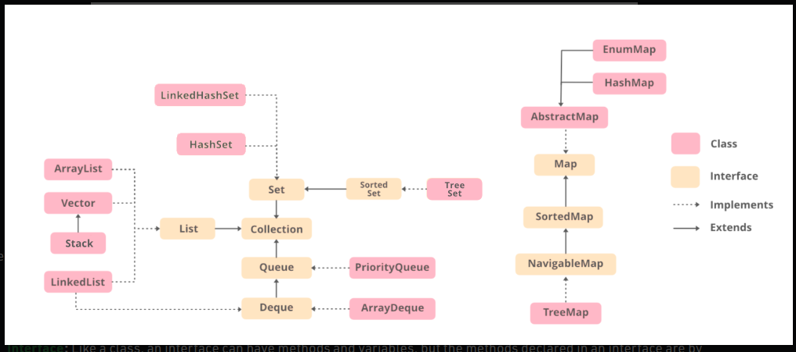

#
## Collection Hierarchy

**Class**: A class is a user-defined blueprint or prototype from which objects are created. It represents the set of properties or methods that are common to all objects of one type.

**Interface**: Like a class, an interface can have methods and variables, but the methods declared in an interface are by default abstract (only method signature, no body). Interfaces specify what a class must do and not how. It is the blueprint of the class.

* Declaration: The code set in bold are all variable declarations that associate a variable name with an object type.

* Instantiation: The new keyword is a Java operator that creates the object.

* Initialization: The new operator is followed by a call to a constructor, which initializes the new object.

**Point originOne** = new Point(23, 94);

**Rectangle rectOne** = new Rectangle(originOne, 100, 200);

**Rectangle rectTwo** = new Rectangle(50, 100);

### Declaring a Variable to Refer to an Object

declare a variable,we write:

    type name;

This notifies the compiler that you will use name to refer to data whose type is type. With a primitive variable, this declaration also reserves the proper amount of memory for the variable.

